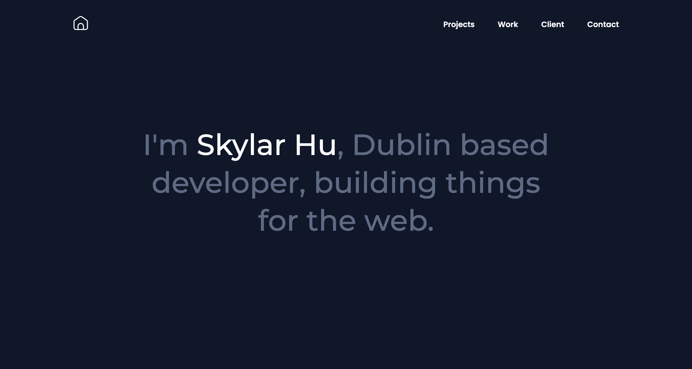
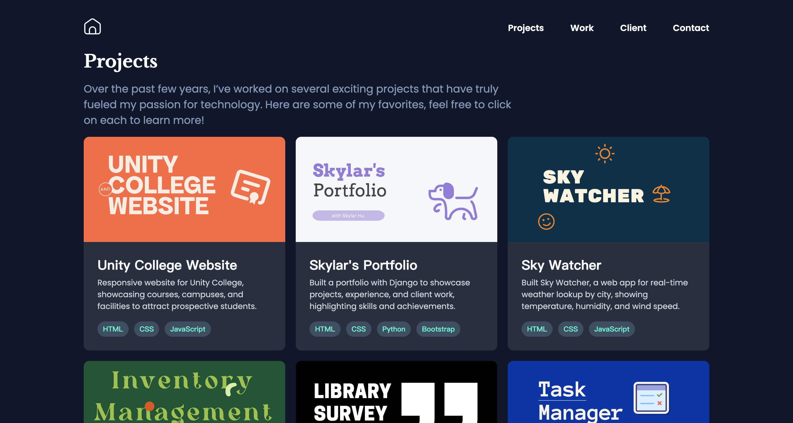
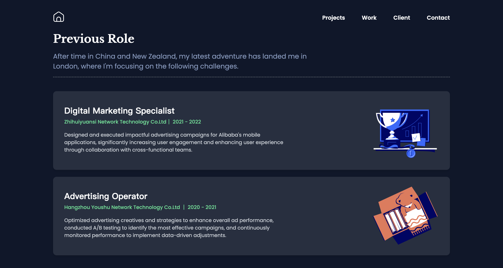
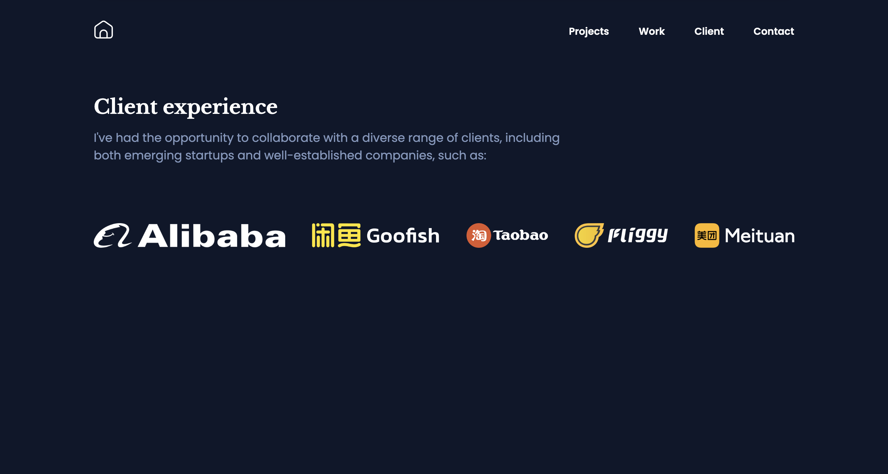

# Personal Portfolio Website

This is my personal portfolio website showcasing various projects. It is built using HTML, CSS, JavaScript, and Django (Python). The website is deployed on AWS.

## Project URL

You can view the live website here: [Skylar's Portfolio Website](https://skylarhu.atwebpages.com/)

## Features

- **Responsive Design:** The website adapts to different screen sizes, ensuring a seamless user experience on both desktop and mobile devices.
- **Project Listings:** Displays all projects with descriptions, images, and tags indicating the technologies used.
- **Project Details Page:** Each project has a dedicated page with more details.

## Technologies Used

- **Frontend:** HTML, CSS, JavaScript
- **Backend:** Python (Django)
- **Database:** SQLite (for development)
- **Deployment:** AWS

## Screenshots

